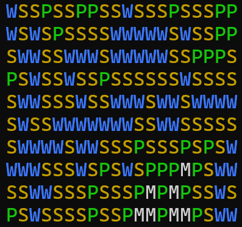

# WaveFunctionCollapseTest

A naive, brute-force C# implementation of the Wave Function Collapse (WFC) algorithm for procedural content generation. This project demonstrates how to analyze sample patterns and generate new, similar content based on learned adjacency rules.

## Here is an example output of the algorithm:


## What is Wave Function Collapse?

Wave Function Collapse is a constraint-based procedural content generation algorithm originally developed by Maxim Gumin. The algorithm works by:

1. **Learning patterns** from sample input data by analyzing which tiles can be adjacent to each other
2. **Propagating constraints** to ensure generated content follows the learned rules
3. **Collapsing possibilities** by selecting specific tiles for positions with the lowest entropy (fewest valid options)

The name comes from quantum mechanics, where a wave function "collapses" from multiple possible states to a single observed state. Similarly, each cell in the output grid starts with multiple possible tile types and "collapses" to a single tile.

## How This Implementation Works

### High-Level Algorithm Steps

1. **Pattern Analysis Phase**
   - Parse the input sample text into a 2D grid
   - Extract unique tile types (M, P, S, W representing different terrain types)
   - Analyze adjacency relationships by counting how often each tile type appears next to others
   - Build probability matrices for each tile type's valid neighbors in all four directions

2. **Generation Phase**
   - Initialize an output grid with all cells in superposition (all possibilities available)
   - Loop until all cells are settled:
     - **Calculate entropy** for each unsettled cell based on constraints from settled neighbors
     - **Find minimum entropy cell** (most constrained position)
     - **Collapse the cell** by randomly selecting a tile type weighted by learned probabilities
     - **Propagate constraints** to neighboring cells

3. **Constraint Propagation**
   - When a cell is settled, it restricts the possible tiles for its neighbors
   - Uses the learned adjacency rules to calculate valid options
   - Handles edge cases where no valid options exist through fallback mechanisms

### Sample Input Format
```
MMMMMPPPPMMM
MMMPPSPPMMMM
MMPSSWSPMMMM
MMPPSWWSPMMM
MMPSWWWSPPPM
MMPSSSSSSPMM
MMMPPPPPPPMM
MMMMMMMMMMMM
```

The algorithm learns from ASCII art patterns like this:

Where:
- `M` = Mountains (Gray)
- `P` = Plains (Green) 
- `S` = Sand/Desert (Yellow)
- `W` = Water (Blue)

## Key Features

- **Real-time visualization** with colored console output
- **Weighted random selection** based on learned probabilities
- **Constraint propagation** ensuring valid adjacencies
- **Fallback mechanisms** for impossible configurations. In this case a random selection of adjacent tiles.
- **Configurable output dimensions** (currently 20x10)

## Technical Implementation

### Core Classes

- **`Probability`**: Stores adjacency counts for each tile type in all four directions
- **Main Algorithm**: Implements the WFC loop with entropy calculation and constraint propagation

### .NET Framework
- Built with **.NET 9** and **C# 13.0**
- Uses modern C# features like collection expressions and improved performance

## Potential Enhancements

### Algorithm Improvements
- [ ] **Better probablyity handline** - Do the probablity correctly using log.
- [ ] **Backtracking support** - Handle impossible states by undoing previous decisions
- [ ] **Multi-scale generation** - Generate at different resolutions
- [ ] **Symmetry breaking** - Add rotation and reflection variants of tiles
- [ ] **Entropy heuristics** - Alternative methods for selecting which cell to collapse next

### Performance Optimizations
- [ ] **Parallel processing** - Multi-threaded constraint propagation
- [ ] **Incremental updates** - Only recalculate affected areas

### Visualization & UI
- [ ] **Web interface** - Browser-based pattern editor and generator

## Getting Started

1. Clone the repository
2. Open in Visual Studio 2022 or later
3. Build and run the project
4. Watch as the algorithm generates terrain based on the sample pattern
5. Modify the `sampleText` variable to experiment with different patterns

The console output shows the generation process in real-time with color-coded terrain types.